# A simplified real-world-project Movie Booking App 🎬 🍿 built with Flutter, Clean Template, BLoC, REST API, Firebase Auth, and Unit Tests (future).

> I’ve open-sourced this project to showcase some of my skills and to help early-career Flutter developers grow in their career.
>
> Like ["Nezha: Birth Of The Demon Child"](https://www.youtube.com/watch?v=xdOgym7MLAU), I believe that for those just starting out in Flutter, completing this project might be a challenge. However, once you get through it, you’ll either succeed or grow stronger. (Không thành công cũng thành nhân) (失败也是成功)
>
> I’ll also support so feel free to start with new issue if you have difficulty because I know it’s not as easy for everyone. :muscle:


## Happy new year 2025 🎉

2025 kicks off with AI evolving at an incredible pace, but also brings a wave of layoffs in the IT industry. Don’t be too afraid! This is not the end—stay patient, keep learning, and wait for the right moment.

And what could be better than starting a new project to kick off the year? 

## Working application

Check out the **live web demo** -> _coming soon_ 


<table>
  <tr>
    <th>Screen</th>
    <th>Preview</th>
    <th>Screen</th>
    <th>Preview</th>
  </tr>
  <tr>
    <td>Begin Screen</td>
    <td></td>

  </tr>
  <tr>
    <td>Home Screen</td>
    <td>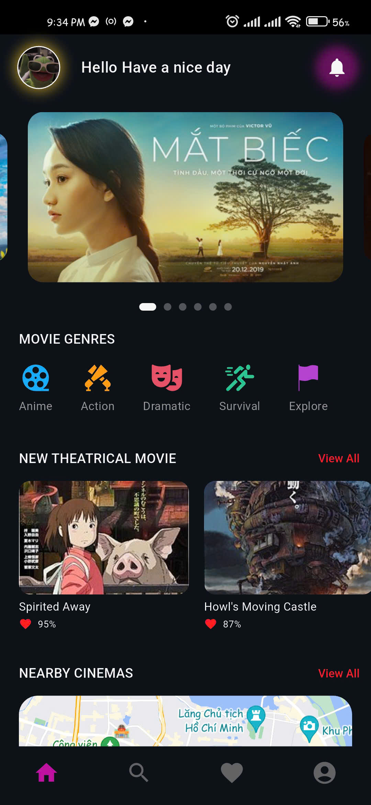</td>
    <td>Movie Screen</td>
    <td>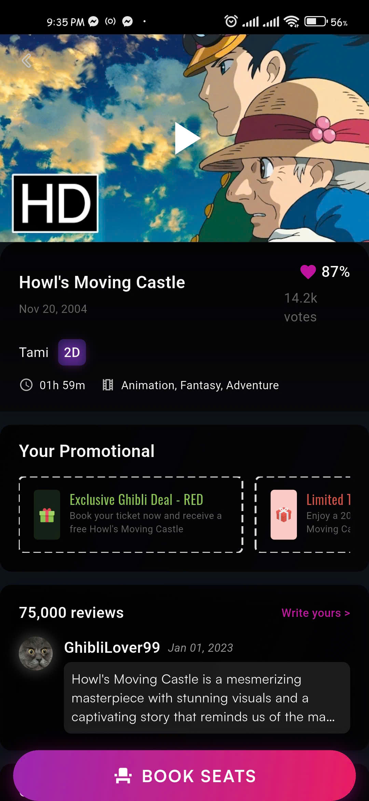</td>
  </tr>
  <tr>
    <td>Login Screen</td>
    <td>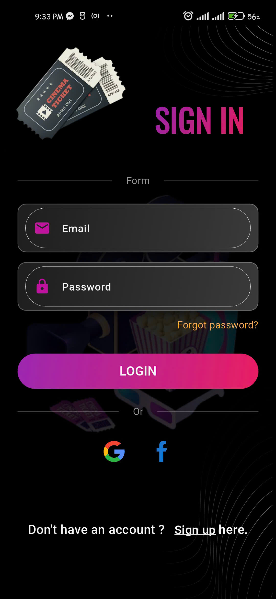</td>
    <td>Register Screen</td>
    <td>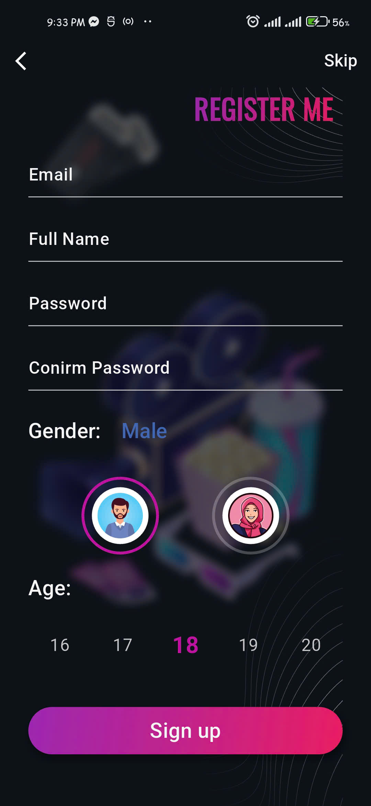</td>
  </tr>
  </tr>
    <tr>
    <td>All Movie Screen</td>
    <td>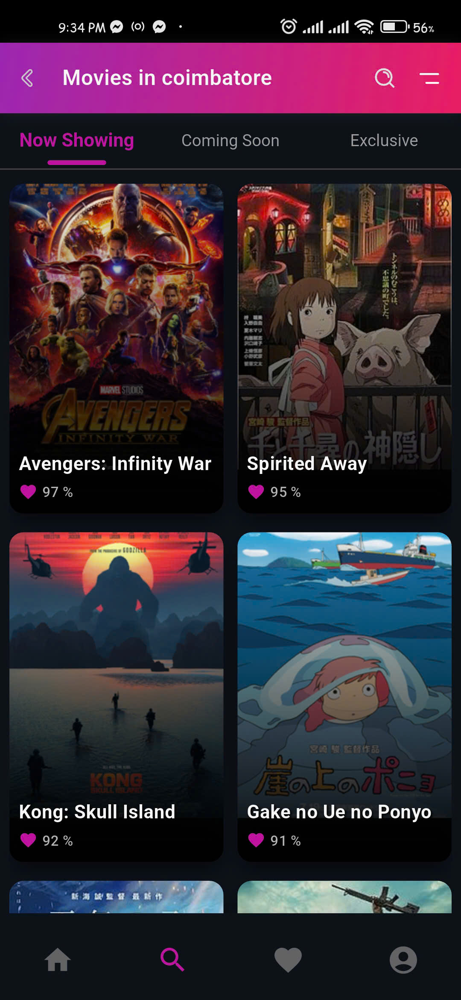</td>
    <td>About Screen</td>
    <td>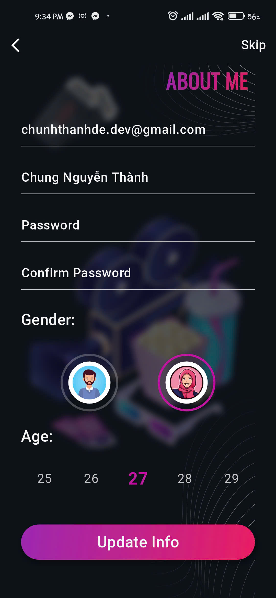</td>
  </tr>
  <tr>
    <td>Booking Time</td>
    <td>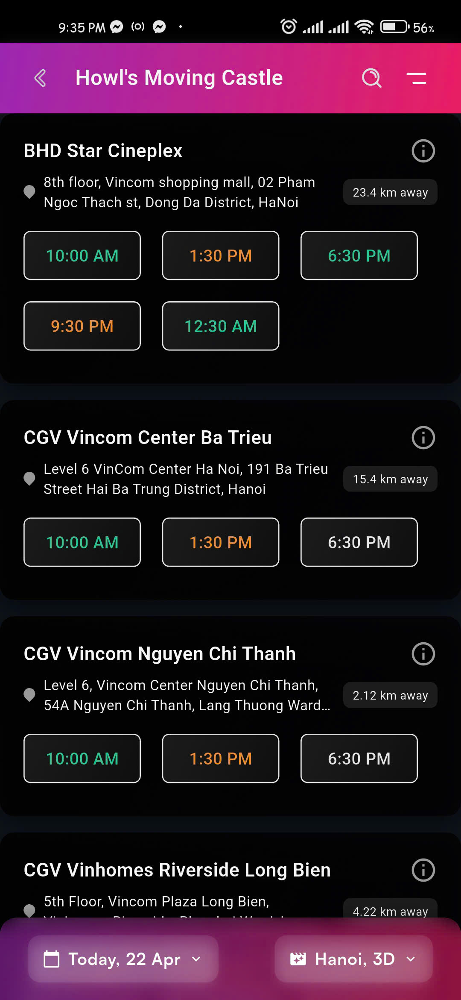</td>
    <td>Booking Seat Type</td>
    <td>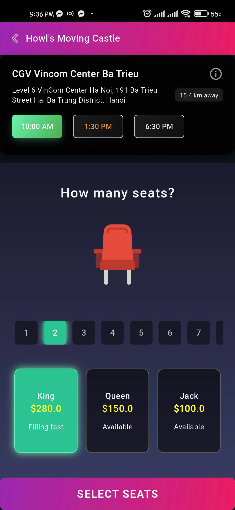</td>
  </tr>
  <tr>
    <td>Booking Slot</td>
    <td>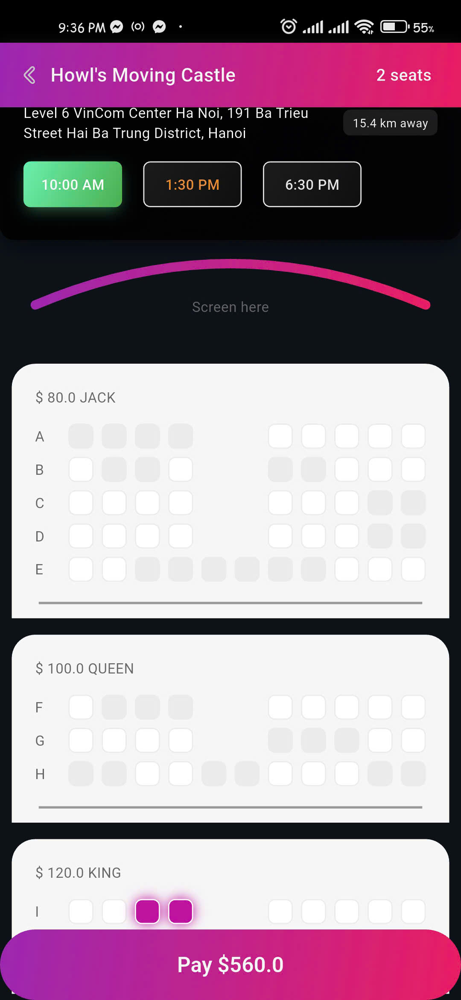</td>
    <td>Tickets Screen</td>
    <td>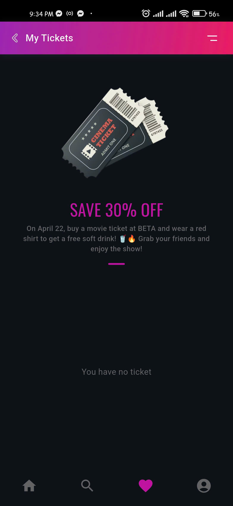</td>
  </tr>
</table>


## 🎬 Cinema Booking

### What Cinema Booking ?

Cinema Booking is an application that helps users search for and book movie tickets at cinemas in Hanoi. The app offers a user-friendly and cinematic interface, quick operations, and a convenient ticket-booking experience.

It leverages Flutter Clean Architecture and Flutter BLoC, ensuring a well-structured and scalable design that facilitates future growth, comprehensive testing, and efficient QA processes. That also makes it easy to develop hard-to-reach UseCase in the future

### 📌 Cinema Booking Components

This is the collection of components that I developer for [Cinema Booking](https://github.com/ChunhThanhDe/cinema-booking), includes:

- ✅ Splash and Get Start ([#8 feat screen splash](https://github.com/ChunhThanhDe/cinema-booking/pull/8)) ([#10 feat get-start welcome screen](https://github.com/ChunhThanhDe/cinema-booking/pull/10))
- ✅ Login ([#19 feat login screen](https://github.com/ChunhThanhDe/cinema-booking/pull/19))
- ✅ Home Main ([#20 feat home screen](https://github.com/ChunhThanhDe/cinema-booking/pull/20))
- ✅ Movie Detail ([#25 feat detail movie screen](https://github.com/ChunhThanhDe/cinema-booking/pull/25))
- ✅ Search All Movie ([#28 feat all movie screen](https://github.com/ChunhThanhDe/cinema-booking/pull/28))
- ✅ Booking Tickets Movie ([#33 feat booking movie tickets screen](https://github.com/ChunhThanhDe/cinema-booking/pull/33))
- ✅ Tickets hold ([#38 feat screen tickets hold](https://github.com/ChunhThanhDe/cinema-booking/pull/38))
- ✅ Mock API Postman for RestAPI

#### 🚀 More to come... 

- [ ] Theme mode
- [ ] Unit/Integration tests
- [ ] Payment Screen
- [ ] Search All Cinema in Hanoi
- [ ] Crawl data from Cinema Website
- [ ] IOS version
- [ ] Web version

Check out the **Cinema Booking roadmap** -> [#43 Roadmap](https://github.com/ChunhThanhDe/cinema-booking/issues/43)

<!-- TODO: Demo -->

## Support 💖

If you like my work, feel free to:

- ⭐ Star this repository to show your support! 🚀
- [Tweet][tweet] about Cinema Booking.
- If you want to support more, you can check out [my GitHub Sponsor page](https://github.com/sponsors/chunhthanhde) xD.


Your support means a lot! Thank you for stopping by and contributing to the project. 🎬🍿

[tweet]: https://twitter.com/intent/tweet?url=https%3A%2F%2Fgithub.com%2Fchunhthanhde%2Fcinema-booking&text=Check%20out%20this%20awesome%20Cinema%20Booking%20app%20built%20with%20Flutter!&hashtags=Flutter,Firebase,Dart

## Who is it for 🤷‍♀️

I have been working with Flutter and Java for about three years. I built cool stuff at VNPT Technology but most of them are system applications based on AOSP source code and are under security contracts, making it difficult to showcase them..

This is a showcase user-facing application that I built in my spare time to expand my experience in application development and explore various technologies and new libraries I wanted to try, such as `Firebase`, `Google Maps`, `Payment`,... and more.

There are many Flutter examples on the web but most of them are way too simple. I like to think that this codebase contains enough complexity to offer valuable insights to **Flutter developers of all skill levels** while still being _relatively_ easy to understand.

---

This piece of work is also part of my technical series [Flutter-Journey](https://github.com/Flutter-Journey), which aims to empower developers to **build and scale their own Flutter applications**. My desire is to advocate and grow the Flutter developer community in Vietnam.


## 📦 Tech Stack

Some libraries are used in this project and shout out to them because they are very helpful for the community

<table>
  <tr>
    <th>Category</th>
    <th>Library</th>
    <th>Description</th>
    <th>Icon</th>
  </tr>

  <!-- Framework -->
  <tr>
    <td>Framework</td>
    <td><a href="https://github.com/flutter/flutter">Flutter</a></td>
    <td>Flutter makes it easy and fast to build beautiful apps for mobile and beyond.</td>
    <td></td>
  </tr>

  <tr>
    <td>Language</td>
    <td><a href="https://github.com/dart-lang/sdk">Dart</a></td>
    <td>The Dart SDK, including the VM, JS and Wasm compilers, analysis, core libraries, and more.</td>
    <td></td>
  </tr>

  <!-- Authentication -->

   <tr>
    <td>Authentication</td>
    <td><a href="https://github.com/firebase/flutterfire">Firebase Auth</a></td>
    <td>Handles user authentication.</td>
    <td></td>
  </tr>

  <tr>
    <td></td>
    <td><a href="https://github.com/flutter/packages/tree/main/packages/google_sign_in/google_sign_in">Google Sign-In</a></td>
    <td>Enables login via Google accounts.</td>
    <td></td>
  </tr>

  <!-- State Management -->
  <tr>
    <td>State Management</td>
    <td><a href="https://github.com/felangel/bloc">Flutter BLoC</a></td>
    <td>A predictable state management library that helps implement the BLoC design pattern.</td>
    <td></td>
  </tr>

  <tr>
    <td></td>
    <td><a href="https://github.com/felangel/bloc/tree/master/packages/hydrated_bloc">Hydrated BLoC</a></td>
    <td>hydrated_bloc exports a Storage interface which means it can work with any storage provider. Out of the box, it comes with its own implementation: HydratedStorage.</td>
    <td></td>
  </tr>

  <tr>
    <td></td>
    <td><a href="https://github.com/felangel/equatable">Equatable</a></td>
    <td>A Dart package that helps to implement value based equality without needing to explicitly override == and hashCode.</td>
    <td></td>
  </tr>
  </tr>
    <tr>
    <td>Support State Management</td>
    <td><a href="https://github.com/spebbe/dartz">dartz</a></td>
    <td>Dartz is a functional programming (FP) library for Dart, providing immutable data structures, type classes, monads, and tools inspired by Haskell.</td>
    <td></td>
  </tr>

  <!-- Dependency Injection -->
  <tr>
    <td>Dependency Injection</td>
    <td><a href="https://github.com/fluttercommunity/get_it">Get It</a></td>
    <td>Get It - Simple direct Service Locator that allows to decouple the interface from a concrete implementation and to access the concrete implementation from everywhere in your App.</td>
    <td></td>
  </tr>

  <!-- Database & Storage -->
  <tr>
    <td>Database & Storage</td>
    <td><a href="https://github.com/firebase/flutterfire">Cloud Firestore</a></td>
    <td>Provides a NoSQL real-time database.</td>
    <td></td>
  </tr>

  <tr>
    <td></td>
    <td><a href="https://github.com/flutter/packages/tree/main/packages/shared_preferences/shared_preferences">Shared Preferences</a></td>
    <td>Wraps platform-specific persistent storage for simple data (NSUserDefaults on iOS and macOS, SharedPreferences on Android, etc.). Data may be persisted to disk asynchronously, and there is no guarantee that writes will be persisted to disk after returning, so this plugin must not be used for storing critical data.</td>
    <td></td>
  </tr>

  <tr>
    <td></td>
    <td><a href="https://github.com/tekartik/sqflite">Sqflite</a></td>
    <td>Local SQLite database for persistent data.</td>
    <td></td>
  </tr>

  <!-- Networking & API -->
  <tr>
    <td>Networking & API</td>
    <td><a href="https://github.com/cfug/dio">Dio</a></td>
    <td>A powerful HTTP client for Dart and Flutter, which supports global settings, Interceptors, FormData, aborting and canceling a request, files uploading and downloading, requests timeout, custom adapters, etc.</td>
    <td></td>
  </tr>

  <tr>
    <td></td>
    <td><a href="https://github.com/trevorwang/retrofit.dart">Retrofit</a></td>
    <td>retrofit.dart is an dio client generator using source_gen and inspired by Chopper and Retrofit.</td>
    <td></td>
  </tr>

  <!-- UI & Effects -->
  <tr>
    <td>UI & Effects</td>
    <td><a href="https://github.com/flutter/packages/tree/main/third_party/packages/flutter_svg">Flutter SVG</a></td>
    <td>Draw SVG files and Render SVG images in Flutter.</td>
    <td></td>
  </tr>

  <tr>
    <td></td>
    <td><a href="https://github.com/hnvn/flutter_shimmer">Shimmer</a></td>
    <td>A package provides an easy way to add shimmer effect in Flutter project by Vietnamese Developer.</td>
    <td></td>
  </tr>

  <tr>
    <td></td>
    <td><a href="https://github.com/serenader2014/flutter_carousel_slider">Carousel Slider</a></td>
    <td>A flutter carousel widget, support infinite scroll, and custom child widget..</td>
    <td></td>
  </tr>

  <tr>
    <td></td>
    <td><a href="https://github.com/ajilo297/Flutter-Dotted-Border">Dotted Border</a></td>
    <td>A Flutter package to easily add dashed borders around widgets.</td>
    <td></td>
  </tr>

  <!-- Code Generation -->
  <tr>
    <td>Code Generation</td>
    <td><a href="https://github.com/google/json_serializable.dart">Json Serializable</a></td>
    <td>Generates utilities to aid in serializing to/from JSON.</td>
    <td></td>
  </tr>

  <tr>
    <td></td>
    <td><a href="https://github.com/rrousselGit/freezed">Freezed</a></td>
    <td>Code generation for immutable classes that has a simple syntax/API without compromising on the features.</td>
    <td></td>
  </tr>
  </tr>
    <tr>
    <td></td>
    <td><a href="https://github.com/trevorwang/retrofit.dart/">retrofit_generator</a></td>
    <td>retrofit.dart is an dio client generator using source_gen and inspired by Chopper and Retrofit.</td>
    <td></td>
  </tr>
  </tr>
    <tr>
    <td>Navigation</td>
    <td><a href="https://github.com/flutter/packages/tree/main/packages/go_router">Go Router</a></td>
    <td>A declarative routing package for Flutter that uses the Router API to provide a convenient, url-based API for navigating between different screens. You can define URL patterns, navigate using a URL, handle deep links, and a number of other navigation-related scenarios.</td>
    <td></td>
  </tr>

  <tr>
    <td>Video & Multimedia</td>
    <td><a href="https://github.com/sarbagyastha/youtube_player_flutter">YouTube Player Flutter</a></td>
    <td>A Flutter plugin for inline playback or streaming of YouTube videos using the official iFrame Player API.</td>
    <td></td>
  </tr>

  <tr>
    <td>Google Maps</td>
    <td><a href="https://github.com/flutter/packages/tree/main/packages/google_maps_flutter/google_maps_flutter">Google Maps Flutter</a></td>
    <td>A Flutter plugin that provides a Google Maps widget. Displays Cinema locations on maps.</td>
    <td></td>
  </tr>

  <!-- App Icons -->
  <tr>
    <td>App Icons</td>
    <td><a href="https://github.com/fluttercommunity/flutter_launcher_icons">Flutter Launcher Icons</a></td>
    <td>A package which simplifies the task of updating your Flutter app's launcher icon. Fully flexible, allowing you to choose what platform you wish to update the launcher icon for and if you want, the option to keep your old launcher icon in case you want to revert back sometime in the future.</td>
    <td></td>
  </tr>
</table>


This stack ensures **Cinema Booking** is well-optimized for **scalability, seamless API integration, and an excellent user experience.** 🚀🎬

## 📐 High Level Design

Following a standard approach to mobile development, I designed a simple high-level architecture for the application.

### ERD (Entity-Relationship Diagram) 

It describes how the data tables in the cinema system are linked together, including entities such as User, Booking, Movies, Cinema, Show Time, Seats and the relationships between them. 

Since it may be updated less frequently than the Draw.io file, it would be better for you to read the drawing file instead. 🥘

<p align="center">
  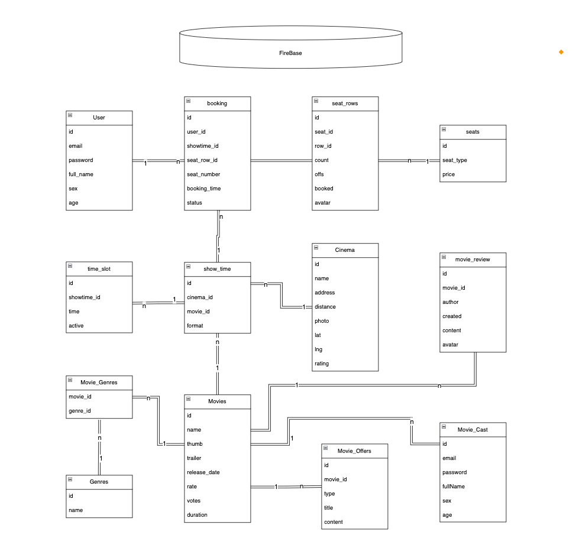
</p>

### Application architecture (Flutter Clean Bloc Architecture)

Main Source Code Project

```Console

├───common                               # Shared utilities and reusable components
│   ├───bloc                             # Global state management using BLoC
│   │   ├───authentication               # Authentication BLoC (for Know has login before)
│   │   └───theme                        # Theme management BLoC
│   ├───helpers                          # Helper functions and utilities
│   └───widgets                          # Reusable Custom UI components
│       ├───appbar         
│       ├───button         
│       ├───footer                 
│       ├─── ...
├───core                                 # Core functionality and configurations
│   ├───api                              # API-related functionalities
│   ├───configs                          # Application-wide configurations
│   │   ├───assets                       # Asset management
│   │   └───theme                        # Theme settings (Color font)
│   ├───constants                        # Constant values
│   ├───enum                             # Enum definitions
│   ├───local                            # Local storage management
│   └───usecase           
├───data                                 # Data layer (models, repositories, data sources)
│   ├───models                           # Data models (DTO)
│   │   ├───auth          
│   │   ├───booking       
│   │   ├───cast          
│   │   ├───cinema        
│   │   ├─── ...     
│   ├───repository                       # Repository layer for data fetching
│   │   ├───all_movie     
│   │   ├───auth          
│   │   ├───authentication 
│   │   ├─── ...     
│   └───sources                          # Data sources (API, local storage, etc.)
│       ├───all_movie   
│       ├───auth          
│       ├───authentication 
│       ├─── ...       
├───domain                               # Domain layer (business logic, entities, use cases)
│   ├───entities                         # Core business entities ()
│   │   ├───auth          
│   │   ├───booking      
│   │   ├───cast        
│   │   ├───cinema        
│   │   ├─── ...    
│   ├───repository                       # Abstract repository interfaces
│   │   ├───all_movie    
│   │   ├───auth         
│   │   ├───authentication 
│   │   ├─── ...     
│   │   └───tickets       
│   └───usecase                          # Business logic use cases
│       ├───all_movie    
│       ├───authentication 
│       ├───booking_time  
│       ├─── ...        
└───presentation                         # Presentation layer (UI and state management)
    ├───about_page                       # About screen
    │   ├───bloc                         # BLoC for About page
    │   └───widgets                      # UI components
    ├───all_movies       
    │   ├───bloc         
    │   └───widgets     
    ├───all_tickets          
    ├───booking          
    │   ├───booking_seat_slot 
    │   ├───booking_seat_type 
    │   ├───booking_time_slot 
    │   └───model        
    ├───home                 
    ├───intro            
    ├───login                 
    ├───movie_detail     
    ├───register         
    ├───splash     

```      

## ⏳ Time Spending

It is a side project that I only spent time outside of the office hours to work on. also i spent 5 hours on this README :))

According to the WakaTime report, I've spent at least 120 hours on this project. That's equivalent to binge-watching an entire season of a TV show... or staring at the screen, debugging, and wondering why it works on my machine but not theirs. 😂

I really enjoyed working on this project. I hope it will bring a lot of value to early Flutter Developers.

| on Window Machine | On Macbook Machine | 
|---|---|
|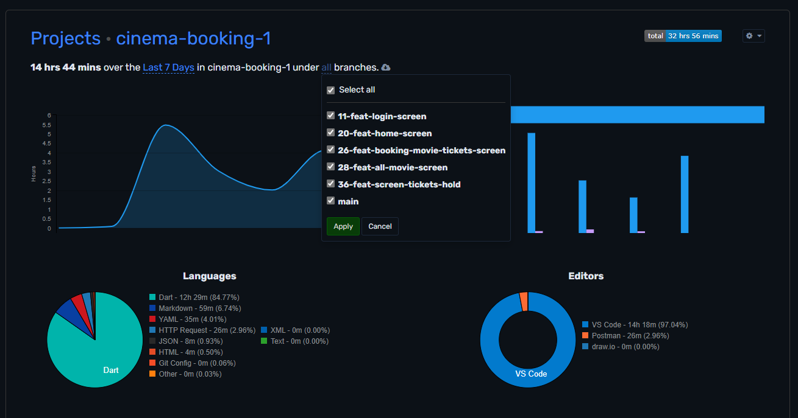 | 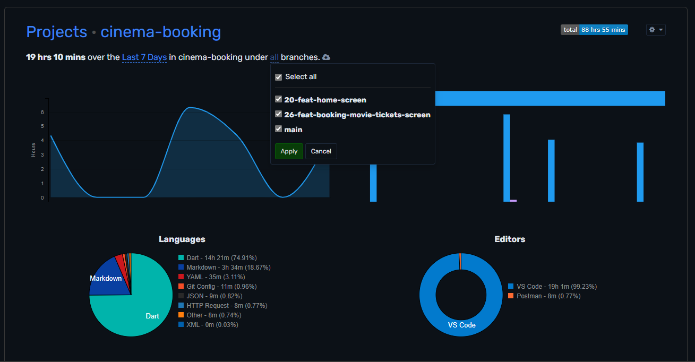


## Author: Chung Nguyen Thanh ✍️

- young software engineer - hoc căng chơi giỏi. Working with Flutter and Java. Like photography, amateur filmmaker and reading books.
- Card visit: https://chunhthanhde.github.io/card 
- Personal blog: https://chunhthanhde.hashnode.dev/
- Say hello: chunhthanhde.dev@gmail.comcom

## 🌍 Contributing

If you have any ideas, just [pen an issue](https://github.com/ChunhThanhDe/cinema-booking/issues) and tell me what you think.

If you'd like to contribute, please fork the repository and make changes as you'd like. [Pull requests](https://github.com/ChunhThanhDe/cinema-booking/pulls) are warmly welcome.

## Credits 🏆

Inspired by [KhoaSuperman/findseat](https://github.com/KhoaSuperman/findseat)

I have reused part of the code `Bloc` and `Data Mock` from this project.

## License

Feel free to use my code on your project. It would be great if you put a reference to this repository.
