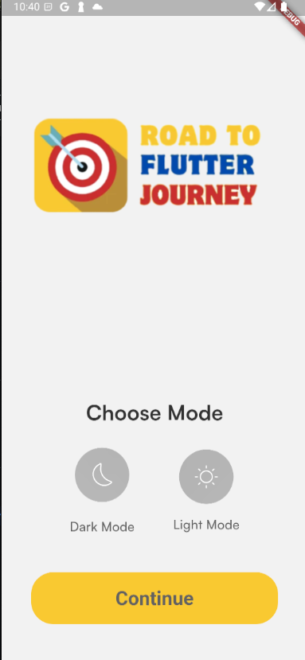
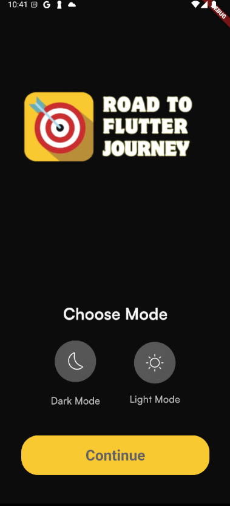
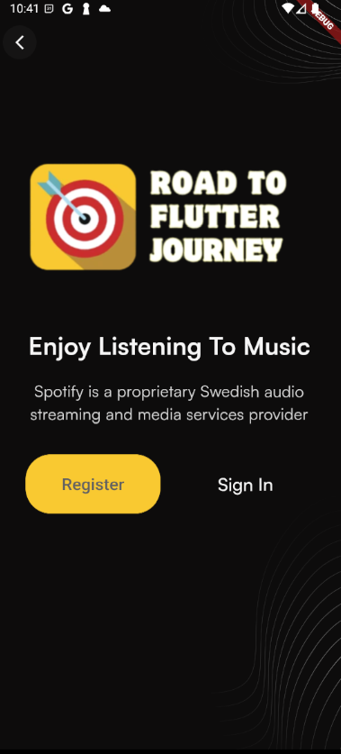
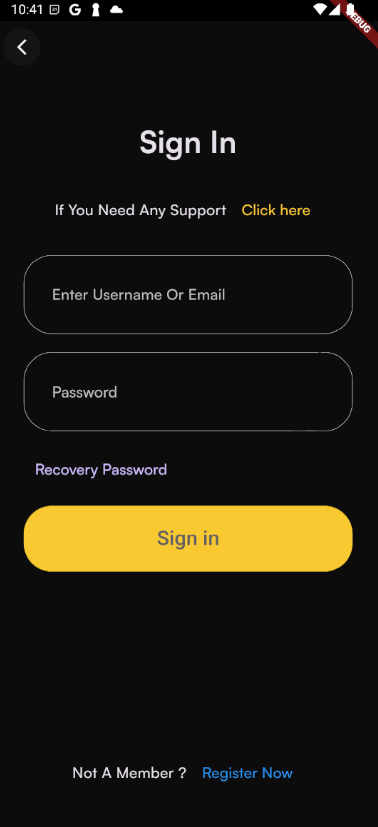
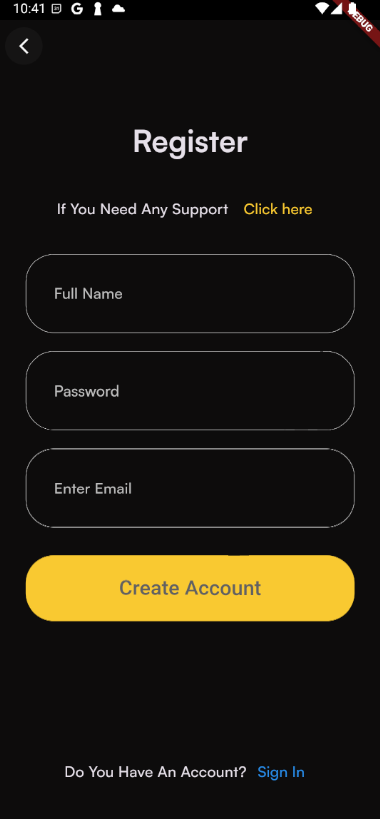

# 🚀 Flutter Clean Architecture Template

A clean, scalable, and maintainable **Flutter project template** using Clean Architecture.

Starring ⭐ this repository if you find it useful!

###### Contact for work, email: chunhthanhde.dev@gmail.com

<br>


<br>


<a href="https://www.linkedin.com/in/chunhthanhde/">

</a>

<a href="https://www.buymeacoffee.com/chunhthanhde" target="_blank"></a>

## 🎯 Overview

**Flutter Clean Architecture Template** provides a solid base structure for your Flutter projects. It follows Clean Architecture principles, promoting separation of concerns and maintainability.

> Note: This template is designed for educational purposes and serves as a base for starting new Flutter projects.

<!-- ## 🖥️ Features (TODO)

- **Feature 1**:
- **Feature 2**:  -->

<!-- ## 🎨 Figma Design (Optional)

- [Design Reference](https://www.figma.com/community/file/example-link) -->

## 🛠️ Technologies Used

| **Library**       | **Purpose**                                                                                                                                                           |
| ----------------- | --------------------------------------------------------------------------------------------------------------------------------------------------------------------- |
| **flutter_bloc**  | A library for implementing the BLoC (Business Logic Component) pattern in Flutter apps, helping manage app state efficiently.                                         |
| **hydrated_bloc** | An extension of `flutter_bloc` that allows persisting the BLoC state across app restarts, retaining data even after the app is closed.                                |
| **path_provider** | A Flutter plugin used to find the correct paths for storing files on the device, helping identify directories for documents, temporary storage, and external storage. |
| **get_it**        | A service locator for Dart and Flutter, making dependency injection easy and simplifying object management across different parts of an app.                          |
| **dartz**         | A functional programming library for Dart that provides features like Option, Either, and Tuple to improve handling of nullable values and side effects in code.      |

## 🔧 Setup and Installation

1. Clone the repository:

```bash
   git clone https://github.com/Flutter-Journey/Flutter-Clean-Template.git
```

2. Navigate to the project directory:

```bash
   cd Flutter-Clean-Template
```

3. Install dependencies:

```bash
   flutter pub get
```

4. Run the app:

```bash
   flutter run
```

## 📸 Screenshots

| Get Start Screen                             | Choose Mode (Light) Screen                           | Choose Mode (Dark) Screen                           |
| -------------------------------------------- | ---------------------------------------------------- | --------------------------------------------------- |
|  |  |  |

| Sign In Screen                             | Sign Up Screen                             | Profile Screen                             |
| ------------------------------------------ | ------------------------------------------ | ------------------------------------------ |
|  |  |  |

## ⭐ Star History

<div align="center">

<a href="https://star-history.com/#Flutter-Journey/Flutter-Clean-Template&Date">
 <picture>
   <source media="(prefers-color-scheme: dark)" srcset="https://api.star-history.com/svg?repos=Flutter-Journey/Flutter-Clean-Template&type=Date&theme=dark" />
   <source media="(prefers-color-scheme: light)" srcset="https://api.star-history.com/svg?repos=Flutter-Journey/Flutter-Clean-Template&type=Date" />
   
 </picture>
</a>

#### Made by Flutter  with Love ❤️ | Developed by [ChunhThanhDe](https://github.com/chunhthanhde)

</div>
